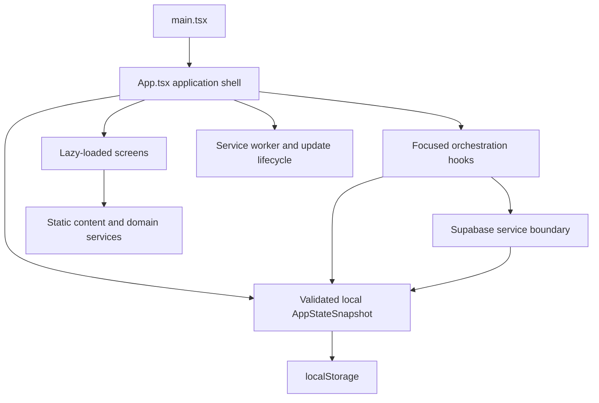

# Application architecture

This document describes Azkarapp's runtime structure and the boundaries maintainers must preserve. Update it whenever ownership, persistence, remote services, build behavior, or navigation materially changes.

## Runtime overview



`App.tsx` owns the current view, shared preference state, profile/session state, and screen composition. Screens receive explicit typed props. Hooks isolate multi-step behaviors such as authentication, remote synchronization, audio, reminders, and reading sessions.

## Startup and state lifecycle

1. `main.tsx` mounts the React application and global styles.
2. `App.tsx` calls `loadAppState()` once and uses the normalized snapshot to initialize React state.
3. `normalizeAppState()` validates every persisted field, applies defaults, repairs legacy values, and drops unsafe collection entries.
4. `appStateSnapshot` recomposes the authoritative serializable state from React values.
5. A persistence effect writes the snapshot through `saveAppState()`.
6. When authenticated sync returns remote data, `mergeAppStates()` applies deterministic merge rules and the result is normalized again before rendering.

Never render untrusted persisted or remote data directly.

## State ownership

| Concern                                             | Owner                                                        |
| --------------------------------------------------- | ------------------------------------------------------------ |
| Navigation/view and application shell               | `src/app/App.tsx`                                            |
| Serializable types                                  | `src/app/types.ts`                                           |
| Defaults, migration, validation, merge, persistence | `src/app/state.ts`                                           |
| Completion-day calculations                         | `src/app/progress.ts`                                        |
| Screen-local form and transient UI state            | Owning screen/panel                                          |
| Remote account synchronization                      | `src/app/hooks/useRemoteAccountSync.ts`                      |
| Authentication operations                           | `src/app/hooks/useAuthHandlers.ts` and `src/lib/supabase.ts` |
| Reading-session mutations                           | `src/app/hooks/useSessionHandlers.ts`                        |
| Prayer calculation and Aladhan boundary             | `src/app/content/prayerCalculation.ts`                       |

When adding a persisted field:

1. Add it to the relevant type in `types.ts`.
2. Add a safe default in `DEFAULT_APP_STATE`.
3. Normalize it in `normalizeAppState()`.
4. Define merge behavior in `mergeAppStates()`.
5. Include it in `App.tsx`'s serialized snapshot and remote-state application.
6. Add corruption, round-trip, and merge tests in `state.test.ts`.
7. Document user-visible or operational effects.

## Navigation and screen loading

The application uses a typed `View` state and browser history rather than a route framework. `push`, `pop`, and pop-state handling keep browser navigation synchronized with the displayed screen. Major screens are lazy loaded through `React.lazy` and wrapped by the shared suspense fallback.

`src/app/routing.ts` maps `View` (plus the active collection, zikr index, and search query) to a hash route such as `#/home`, `#/azkar/morning`, `#/azkar/before-sleep/5`, or `#/search/<query>`. Hash routes are used because GitHub Pages cannot rewrite arbitrary paths to `index.html`. The reader index is one-based in the URL so it matches the position shown on screen, and zero-based in state.

There is exactly one writer for the address bar: an effect in `App.tsx` that calls `replaceState` whenever the route-relevant state changes. `push` creates the history entry and that effect writes the URL, so navigation that bypasses `push` (keyboard shortcuts, app shortcuts) still produces a correct URL. Reading back is handled by `parseLocation`, wired to both `popstate` and `hashchange` — the latter is what makes a hand-typed or shared URL work. Direct routes to lazy collections register their content before rendering, and an out-of-range reader position falls back to the collection instead of mounting an undefined zikr.

Onboarding and auth steps have no hash route on purpose: they are flow states gated by stored progress, not destinations, and `routeToHash` returns null so the URL is left untouched. The single exception is the OAuth return, which arrives as `?view=auth-callback` because `getAuthCallbackUrl` configures the provider redirect that way. Legacy `?view=` links still resolve, so older bookmarks keep working.

A second, narrower `activeTab` state (`home | azkar | progress | settings`) drives which top-level destination the navigation highlights. It is derived from `View` and kept in sync in `App.tsx`; `View` remains the source of truth for what renders.

The shell is adaptive. `useLayoutMode` returns one of four width-only tiers — `compact` (≤599px), `medium` (600–899px), `expanded` (900–1199px), `large` (≥1200px) — and `App.tsx` mounts exactly one navigation component per tier: `BottomNav` for compact and medium, `NavRail` for expanded, `NavSidebar` for large. The corresponding grid areas live in `src/styles/theme/layout.css`; the JS boundaries and the CSS media queries must stay in agreement.

Rules:

- New top-level destinations require a `View` member and an `App.tsx` rendering branch.
- Back actions must preserve predictable browser behavior. `pop()` uses an in-app history depth counter rather than `window.history.length`, so Back can never navigate out of the app.
- Navigation is hidden on splash, onboarding and auth views at every tier, via a single shared view whitelist.
- `App.tsx` owns the one `#main-content` landmark; screens must not render their own `<main>`.
- Focus moves to `#main-content` on every view change (`useViewFocus`), skipping initial load.
- Settings subsections use `SettingsSubScreen` within `SettingsScreen`.
- The Azkar tab always opens the collection index, not an implicit prior category.

## Presentation boundaries

- `screens/` composes pages and coordinates user interaction.
- `components/` owns reusable visual and behavioral patterns.
- `components/ui/` contains vendored or low-level primitives.
- `content/` owns static azkar/category data and domain computations.
- `i18n/` owns translated product copy.
- `styles/` owns semantic tokens, offline system typography, Tailwind integration, safe areas, and global RTL behavior.
- `lib/` owns external SDK boundaries.

Do not place `localStorage`, Supabase, or raw network calls inside reusable visual components.

## Localization and direction

The selected `AppLanguage` controls document language and layout direction. Arabic is RTL; English is LTR unless the accessibility force-RTL preference is active.

- Use logical CSS positioning where possible.
- Preserve semantic DOM and keyboard order.
- Isolate mixed-direction values with `dir="ltr"`, `dir="rtl"`, or `dir="auto"`.
- Zikr text uses the `zikr-text` contract even when embedded in non-reader screens.
- Product copy should be added to `i18n`; tightly scoped domain diagnostics may be bilingual inline until promoted to shared copy.

See `DESIGN_SYSTEM.md` for the authoritative typography, icon, geometry, and motion contracts.

## Local persistence and privacy

The versioned local state key is `azkarapp.state.v1`. Additional narrow caches use their own namespaced keys, such as the daily prayer-time cache. Local session history retains the newest 500 entries to keep persistence bounded. Failed writes are surfaced in the application with retry and dismiss actions instead of failing silently.

Private-data clearing preserves device preferences while removing account-owned profile, saved, session, and completion data. Any new account-owned field must participate in `clearPrivateAppData()`.

Geolocation is requested only after a user action. Precise coordinates remain device-local, are never synchronized to
Supabase, and are sent to Aladhan only to retrieve prayer timings. No service-role Supabase credential belongs in the
browser.

## Remote synchronization

Supabase is optional. Without its environment variables, guest/local mode remains functional.

Authentication is provider-neutral:

- Google and Apple use Supabase OAuth with PKCE and the query-string callback view.
- Email uses a six-digit OTP; no password or SMS path exists.
- Provider buttons are compiled behind `VITE_*_AUTH_ENABLED` flags and remain hidden by default.
- The callback removes temporary OAuth query/hash material after session restoration.
- Profile metadata is normalized from `full_name`, `name`, `display_name`, `avatar_url`, `picture`, then the email prefix.
- If no usable name exists (notably possible with Apple), a profile-completion view is required.

The sync layer:

- Treats local state as the immediate UI source
- Uses the authenticated account ID for ownership
- Serializes uploads so state changes cannot create overlapping remote writes
- Debounces updates, retries recoverable failures, and resumes after the browser returns online
- Records the last successful sync time without making local reading depend on remote success
- Never uploads precise location coordinates
- Merges settings and ledgers deterministically
- Deduplicates saved IDs and completion records
- Surfaces recoverable sync state without blocking local reading
- Loads the Supabase SDK on demand so guest/offline startup does not pay the account-client cost
- Reads the newest 100 sessions through `(user_id, completed_at desc)` and sends at most the same bounded page
- Reads the append-only completion ledger with keyset pagination over its `(user_id, day_key, category)` primary key
- Uses atomic upserts; completion rows conflict on `(user_id, day_key, category)` and are idempotent
- Caches known completion keys per authenticated user to avoid resending already-synchronized ledger rows

All account tables enable RLS. Policies compare `(select auth.uid())` with the indexed owner column so identity is evaluated once per query. `user_settings`, `user_progress`, `daily_collection_completions`, and `saved_zikr` use owner-prefixed primary keys; `session_history` uses `session_history_user_completed_idx` for owner filtering, newest-first reads, and cascade performance. Anonymous privileges are explicitly revoked, and authenticated grants are limited to the operations the browser performs.

For production query review, run representative authenticated plans in Supabase:

```sql
explain (analyze, buffers)
select id, category, completed_at
from public.session_history
where user_id = '<test-user-uuid>'
order by completed_at desc
limit 100;

explain (analyze, buffers)
select day_key, category, time_zone
from public.daily_collection_completions
where user_id = '<test-user-uuid>'
  and (day_key, category) > (date '2026-01-01', 'evening')
order by day_key, category
limit 500;
```

Expected evidence is an index scan using `session_history_user_completed_idx` and the completion-ledger primary key, with no material rows removed by filtering. Save plan output with release evidence when realistic production-sized data is available.

Database schema changes require an ordered migration and corresponding application/tests in the same change.

## Offline and PWA behavior

The production service worker precaches the core application shell. Larger optional screen and content chunks are cached at runtime after first use, which keeps installation lean while preserving repeat offline access. The app exposes install/update UI and quick actions for common collections. When a waiting service worker is detected, the running client fetches `public/release-notes.json` without cache and shows its 3–5 validated highlights in the selected language. This deployed manifest is necessary because the update prompt runs in the older client bundle; invalid or unavailable notes fall back to the generic localized update message, and applying the update remains the user's choice. Applying an update is awaited with a bounded timeout and an actionable failure state; the app does not reload on a blind timer.

Core reading, counting, local progress, settings, and astronomical prayer-time calculation must work without a network. Features that require remote services—account sync, email OTP, OAuth, or fresh Aladhan values—must fail safely and retain local behavior.

## System-state and recovery boundaries

- `StatePanel` owns stable full-surface empty and recovery anatomy. Static empty states have no live-region role; newly occurring failures use an alert, and blocking recovery may focus its heading.
- `retryableScreen` owns screen-chunk loading. A rejected chunk offers an in-place retry and a route back to Azkar while preserving local state. Refresh appears only after the explicit retry also fails.
- Lazy collection hydration uses the same recovery policy and never silently redirects or automatically reloads. Friday supplemental-dua loading fails locally inside Friday rather than removing the rest of that screen.
- `NetworkStatus` announces an offline transition, collapses to an expandable indicator after five seconds, and briefly confirms reconnection. `SyncStatus` remains a separate account concern and never exposes backend messages.
- Authentication and synchronization branch on stable service error codes where available. User copy is localized and safe; privacy-limited observability receives only error class/name and source.
- Async actions disable duplicate submission while pending. Success and cancellation use narrow polite status regions; failures use narrow alerts. The crash boundary remains reserved for unrecoverable application errors.

## Testing strategy

| Layer                          | Expected coverage                              |
| ------------------------------ | ---------------------------------------------- |
| Pure domain functions          | Colocated Vitest tests                         |
| Persistence and merge behavior | `src/app/state.test.ts`                        |
| React behavior                 | Testing Library where DOM interaction matters  |
| Complete user flows            | Playwright in `e2e/`                           |
| Accessibility                  | axe-core plus keyboard/touch-target assertions |
| Production constraints         | Vite build and bundle-budget script            |

`pnpm check` must remain deterministic and network-independent. Tests for network services mock parsing/boundary behavior; a live API smoke test is operational evidence, not a unit-test dependency.

## Extension checklist

Before adding a feature:

- Identify its owning layer and state owner.
- Reuse existing primitives, tokens, icon exports, and localization patterns.
- Define offline and failure behavior.
- Avoid introducing a runtime dependency when a platform API or existing utility is sufficient.
- Add automated coverage proportional to risk.
- Update the README and relevant domain document.
- Run `pnpm check` and relevant Playwright specs.
