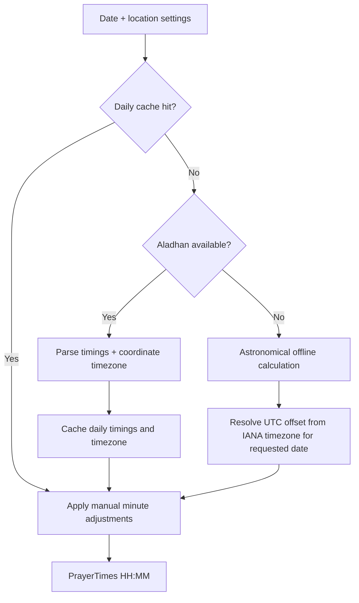

# Prayer times, location, timezone, and DST

This document is the source of truth for Azkarapp's prayer-time pipeline. It explains how online and offline results are selected, how daylight saving is applied, and how maintainers can verify or extend the feature safely.

## User-visible behavior

The Home prayer header displays the next prayer and a live countdown. Settings → Prayer Times & Location allows the user to:

- Detect the current location
- Review the effective IANA timezone and current UTC offset
- See whether daylight saving or standard time is active
- Select a calculation authority
- Search and select a built-in city without sharing GPS data; the preset coordinates and IANA timezone remain available offline
- Enter a manual city, timezone, latitude, and longitude when the built-in list does not include the required location
- Apply a minute adjustment to each prayer

The five calculated prayers are Fajr, Dhuhr, Asr, Maghrib, and Isha.

Home also uses the same calculated boundaries for its featured collection: Morning from Fajr to Asr, Evening from Asr to Isha, and Before Sleep from Isha to the following Fajr. The preferred Evening reading window is communicated as after Asr until Maghrib.

## Resolution flow



`getPrayerTimes()` is synchronous so Home always has an immediate value. It uses cached online data when present and otherwise calculates locally. `triggerBackgroundPrayerTimesRefresh()` updates the daily cache without blocking rendering.

## How automatic DST works

### Online

Aladhan receives latitude, longitude, date, and calculation method. Its response contains local prayer times and `data.meta.timezone`. The app stores that IANA timezone (for example, `Africa/Cairo`) for the coordinates.

The online times are already expressed in the location's local clock, including the applicable offset for that date.

### Offline

The offline engine does not hard-code a `+2` or `+3` offset. It calls `getTimeZoneOffsetHours(date, timeZone)`, which uses `Intl.DateTimeFormat` and the IANA timezone database provided by the browser/runtime. The same timezone therefore returns different offsets on standard-time and DST dates when local law requires it.

For Cairo in 2026:

| Date       | Timezone       | Effective offset | Status                 |
| ---------- | -------------- | ---------------- | ---------------------- |
| January 15 | `Africa/Cairo` | `UTC+02:00`      | Standard time          |
| July 29    | `Africa/Cairo` | `UTC+03:00`      | Daylight saving active |

`getTimeZoneStatus()` samples the selected timezone across the calendar year. If offsets vary, the zone observes a seasonal change. The current date's offset is compared with the standard offset to display the active status in Settings.

### Automatic timezone source priority

When the user selects **Detect My Location**:

1. The browser Geolocation API returns latitude and longitude after permission.
2. Aladhan returns the timezone associated with those coordinates.
3. If the network request fails, `Intl.DateTimeFormat().resolvedOptions().timeZone` supplies the device timezone.
4. The selected timezone is persisted in `UserSettingsState.location`.

The Settings status card makes the effective timezone and UTC offset auditable. If a device is configured with the wrong timezone and the app is offline during detection, the user can correct the IANA timezone manually.

The built-in city selector is a convenience catalogue, not an online geocoder. Selecting a result immediately persists its representative city-centre coordinates and IANA timezone through the same `LocationSettings` boundary as manual entry. Search compares English names, Arabic names, countries, and common aliases without changing displayed text. Locations outside the catalogue remain supported through the manual fields.

## Calculation methods

|  ID | Authority                               |  Fajr |                     Isha |
| --: | --------------------------------------- | ----: | -----------------------: |
|   5 | Egyptian General Authority of Survey    | 19.5° |                    17.5° |
|   4 | Umm Al-Qura University, Makkah          | 18.5° | 90 minutes after Maghrib |
|   3 | Muslim World League                     |   18° |                      17° |
|   2 | Islamic Society of North America        |   15° |                      15° |
|   1 | University of Islamic Sciences, Karachi |   18° |                      18° |

Method definitions live in `CALCULATION_METHODS`. IDs and parameters must remain compatible with Aladhan. Adding a method requires Arabic/English names, offline parameters, UI coverage, and parsing/calculation tests.

## Offline calculation

`calculateOfflinePrayerTimes()` derives:

- Solar declination and equation of time from the requested Gregorian date
- Solar noon from longitude and the date-specific timezone offset
- Fajr and Isha from the method's depression angles
- Dhuhr from solar noon with a small safety margin
- Standard-school Asr from shadow factor 1
- Maghrib from sunset at 0.833° below the horizon

High-latitude cases where the sun reaches sunset but not the selected Fajr or Isha angle use the angle-based portion of the night: `angle / 60 × night duration`. This preserves the normal calculation method on ordinary days and keeps Fajr before Dhuhr and Isha after Maghrib. Polar-day and polar-night results still need comparison with the user's local authority.

## Manual adjustments

Each prayer accepts an integer adjustment from -120 to +120 minutes. Adjustments are applied after either the cached online result or offline calculation, so behavior is consistent across network states. Values wrap safely across midnight.

Manual adjustments do not change the calculation-method parameters or timezone.

## Caching

Daily timings are cached in `localStorage` with:

```text
azkarapp.prayer_times_cache.<local-date>_<lat>_<lng>_<method>
```

Coordinate timezone metadata uses:

```text
azkarapp.prayer_time_zone.<lat>_<lng>
```

Coordinates are rounded to three decimal places in cache keys. A date, method, or meaningful location change naturally produces another key. Invalid JSON, unavailable storage, or quota failures are ignored and fall back to local calculation.

## Failure and privacy behavior

Geolocation failure is classified as unsupported, permission denied, unavailable, timeout, or unknown. Settings gives reason-specific recovery guidance and keeps the previously saved location and prayer settings unchanged. Permission denial points to the browser's site settings; unsupported detection keeps manual latitude, longitude, city, and IANA timezone entry available.

Changing the calculation method remains local-first. If Aladhan verification is unavailable, the selected method is saved and the astronomical local calculation stays active; Settings reports that fallback without interrupting Home.

| Condition                         | Behavior                                                      |
| --------------------------------- | ------------------------------------------------------------- |
| Geolocation denied/unavailable    | Keep existing/default location and show an actionable message |
| Aladhan timeout/error             | Use cached or offline astronomical times                      |
| Invalid cache                     | Ignore it and calculate offline                               |
| Invalid manual coordinates        | Reject the save and retain the previous settings              |
| Invalid/unavailable IANA timezone | Fall back to the device offset                                |
| `localStorage` unavailable        | Continue without caching                                      |

The API timeout is bounded. Geolocation is user-initiated and requires HTTPS or localhost. Coordinates are used for prayer timing and are not needed by Supabase account synchronization.

## Code map

| File                                              | Responsibility                                                                                 |
| ------------------------------------------------- | ---------------------------------------------------------------------------------------------- |
| `src/app/content/prayerCalculation.ts`            | Aladhan boundary, parsing, caches, timezone/DST, offline calculation, adjustments, geolocation |
| `src/app/content/prayerTimes.ts`                  | Current/next prayer selection and countdown formatting                                         |
| `src/app/screens/HomeScreen.tsx`                  | Immediate fallback rendering and background refresh                                            |
| `src/app/screens/settings/NotificationsPanel.tsx` | Location, timezone status, methods, and adjustments UI                                         |
| `src/app/types.ts`                                | `LocationSettings` persistence contract                                                        |
| `src/app/state.ts`                                | Defaults, validation, merge, and persistence                                                   |
| `src/app/content/prayerCalculation.test.ts`       | Parser, timezone/DST, offline, adjustment, and fallback unit tests                             |
| `e2e/narrow-layout.spec.ts`                       | Narrow prayer-header overflow regression                                                       |
| `e2e/responsive.spec.ts`                          | Arabic RTL prayer-header fit                                                                   |

## Verification

Run:

```bash
pnpm test:run
pnpm check
pnpm exec playwright test e2e/narrow-layout.spec.ts
pnpm exec playwright test e2e/responsive.spec.ts --grep "Arabic Home"
```

For a manual location verification:

1. Open Settings → Prayer Times & Location.
2. Select Detect My Location and grant permission.
3. Confirm the displayed IANA timezone matches the location.
4. Confirm the displayed UTC offset matches the current civil time.
5. Check whether Settings reports DST or standard time.
6. Compare the five times with a trusted local authority using the same calculation method.
7. Disable the network, reload, and confirm the countdown still renders from cache/offline calculation.
8. Test a date on each side of a known DST transition through unit tests rather than changing the device clock.

When local authorities differ by a few minutes, confirm the selected calculation method first, then use manual adjustments only when required.
